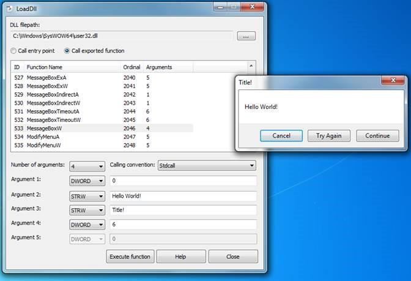
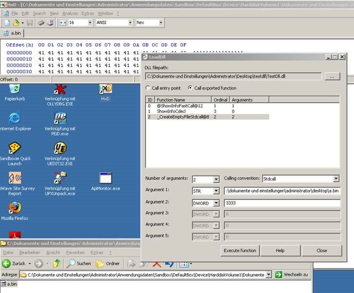
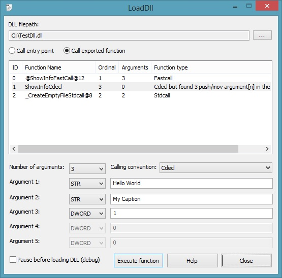

LoadDll
=======
Better version of RunDll with GUI. 
This program allows you to load DLLs on Windows. You can select how to load the DLL. By direct Entry Point call (DllMain) or if you want to call directly an exported function of the DLL.

Supported calling conventions
=============================
Right now I support stdcall, fastcall and cdecl. Cdecl special: In the new version it will try to auto detect how many arguments the function needs (by counting MOV REG, [EBP +] and PUSH [ebp +]).

Number of arguments
===================
The number of arguments will be disassembled and assumed by LoadDll (RETN instruction). You can always change the number of arguments. I support only up to 5 arguments of a function. The argument types can be selected from: DWORD (numeric argument, support for dec and hex. Hex start with 0x), STR (String in ASCII), STRW (Unicode String) and a PTR (pointer which points to a empty memory allocation).

Usage
=====
Load a DLL in LoadDLL and go on!

Source is made for Visual Studio 2010 and uses Length Disassembly Engine (LDE) by BeatriX and MemoryModule by Joachim Bauch. I made this tool in 2011 and updated it in 2014.

Screenshots
===========
Screenshot of LoadDll with executed user32.dll!MessageBoxW:

Screenshot of loading TestDLL in LoadDLL. First argument is a string (filepath) and second one is a DWORD (number of bytes)

New screenshot of the GUI. Now you can check the "Pause before loading DLL (debug)" checkbox if you want to execute an INT 3 before the DLL is loaded or the exported function is executed.

Changes
=======
25.06.2014:
	+ added Drag&Drop support
	+ using Unicode API

23.06.2014:
	+ added "Pause before loading DLL (debug)"
	+ added "Function type" to ListView: guess the function type
	+ added "MemoryModule" by Joachim Bauch
	+ bug fixed in LDE function
